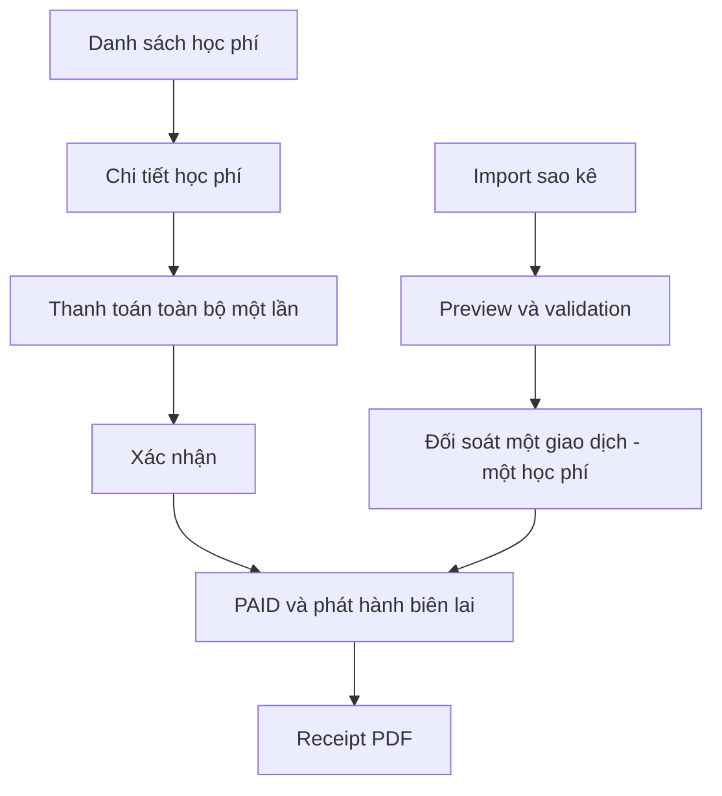

# Navigation flow

Routes chính: `/admin/classes`, `/admin/tuition-fees`, `/admin/receipts`, `/admin/bank-reconciliation`. Thao tác thanh toán thực hiện từ danh sách hoặc chi tiết học phí; lịch sử thu xem tại Biên lai, Báo cáo và Đối soát ngân hàng. Quản lý lịch học nằm trong `/admin/classes/:id` → tab `Lịch học`; không còn màn hình CRUD lịch học độc lập cho ADMIN/STAFF.
