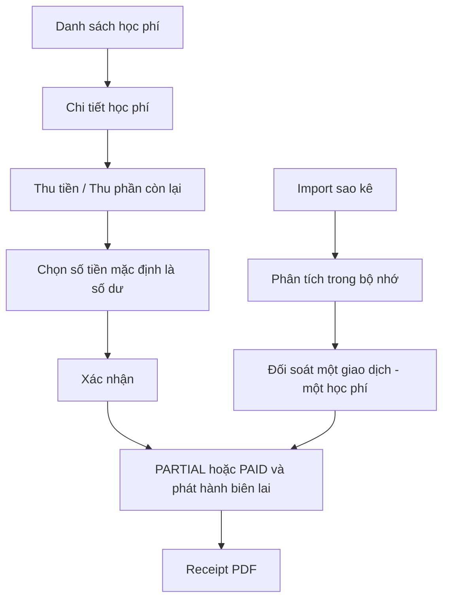

# Navigation flow

Routes chính: `/admin/classes`, `/admin/tuition-fees`, `/admin/receipts`, `/admin/bank-reconciliation`. Thao tác thường ngày bắt đầu bằng `Thu tiền` hoặc `Thu phần còn lại`, hệ thống tự chọn một khoản và điền toàn bộ số dư; `Thu nhiều khoản` là chế độ nâng cao. Lịch sử thu xem tại Biên lai, Báo cáo và payment/payment batch đã xác nhận. Quản lý lịch học nằm trong `/admin/classes/:id` → tab `Lịch học`; không còn màn hình CRUD lịch học độc lập cho ADMIN/STAFF.
